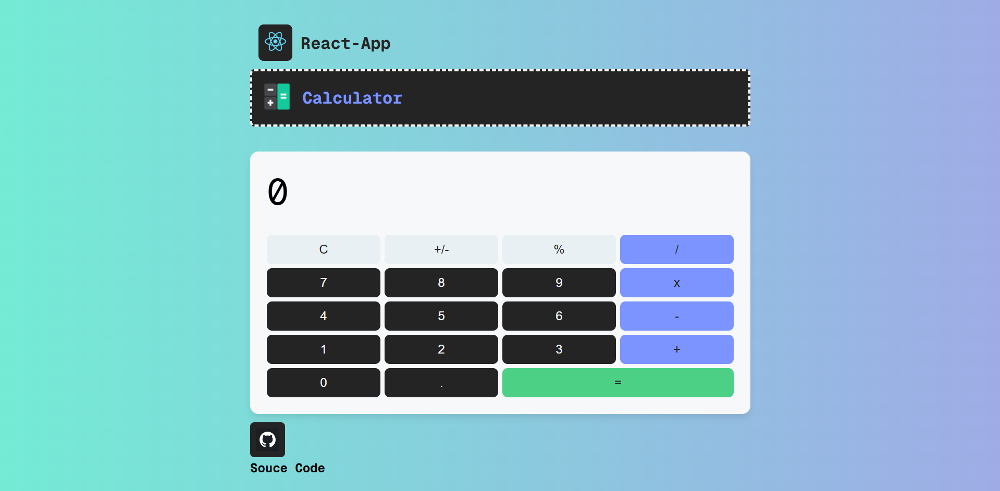

#### Problem statement:

- Create a react calculator app.

#### Technologies Used:

- HTML
- CSS
- JavaScript
- React Js

## Install & Run Project

To install all the dependences of the project, run the following command:

    git clone https://github.com/KorlapuDev/Simple-React-Calculator-App.git
    yarn install
    yarn start

#### Source Code:

- Link : https://github.com/KorlapuDev/Simple-React-Calculator-App

#### Deployment Link:

- Link : https://simple-react-calculator-app-j1ax.vercel.app/

  Show some Love :heart: by starring the repository.

